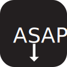

  
  
  # ASAP Download Manager
  ### *The fastest download experience.*
  
  
  
  

  

    <strong>Fast. Responsive. Component-Driven.</strong>
     
    Building a high-performance, cross-platform alternative to IDM, optimized for local bandwidth needs and social media extraction.
  

---

## 🚀 Coming Soon
We are currently in the **Technical Research & Base Architecture** phase. ASAP is being built from the ground up using **PySide6**.

### Key Features Under Development:
- [ ] **Multi-threaded Engine:** Segmented downloading for maximum speed.
- [ ] **Social Media Extraction:** One-click downloads for YouTube, TikTok, Instagram, and more (via `yt-dlp`).
- [ ] **Browser Integration:** Native messaging bridge for Chrome, Edge, and Firefox.
- [ ] **Responsive UI:** Dark/Light mode support with fluid micro-animations.

---

## 🛠️ Tech Stack
- **Language:** Python 3.10+
- **UI Framework:** PySide6 (Qt for Python)
- **Engine:** Requests, Threading, `yt-dlp`
- **Security:** `certifi` for robust SSL handling

---

## ⚖️ License
This project is licensed under the **Apache License 2.0**. 
You are free to use, modify, and distribute this software. See the [LICENSE](LICENSE) file for more details.

---

  Built with ❤️ from Uganda to the World.

